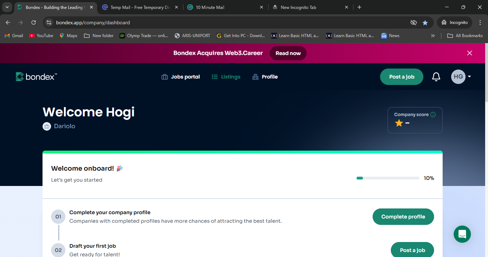
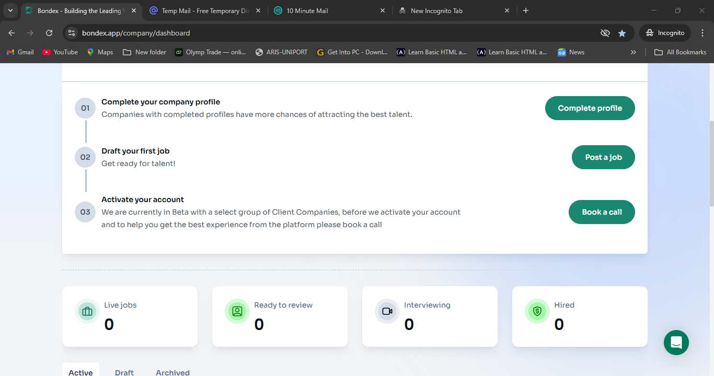

# Bug Report 1: Missing Wallet Connect Option on Company Dashboard

**Environment:**
- Web: https://bondex.app
- Browser: Chrome (Incognito)
- Role: Registered as Company User
- OS: Windows 10 / Android (adjust to your environment)

---

**Title:** Wallet Connect (MetaMask) is missing on Company dashboard

**Severity:** High  
**Priority:** P1

---

**Steps to Reproduce:**
1. Go to https://bondex.app in Chrome Incognito
2. Sign up using Email and choose to register as a Company
3. Complete company registration form with valid inputs
4. Observe dashboard after redirect to `/company/dashboard`

---

**Expected Result:**  
A button or link should exist allowing users to connect their wallet via MetaMask, similar to standard user roles.

**Actual Result:**  
No Wallet Connect option is available anywhere on the Company dashboard.

---

**Impact:**  
Company users are unable to access any blockchain-based functionality such as claiming $BDXN tokens or performing on-chain operations.

---

**Evidence:**  
Screenshots of the company dashboard showing the absence of Wallet Connect UI

---

**Suggested Fix:**  
Ensure that Wallet Connect is visible and enabled for company user roles if they are intended to interact with blockchain features.

**Tags:** wallet-connect, dashboard, company-role, web3